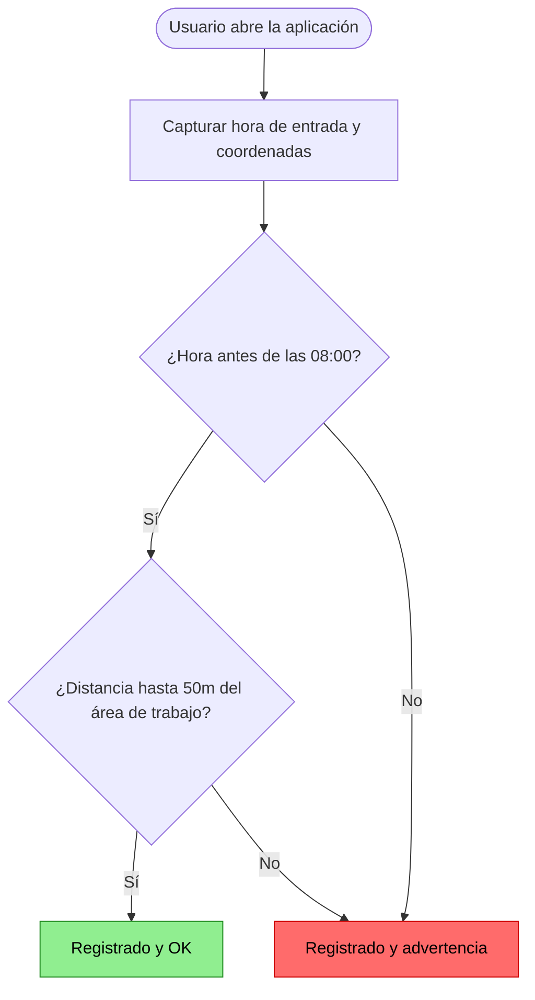

```mermaid
flowchart TD
    A([Usuario abre la aplicación]) --> B[Capturar hora de entrada y coordenadas]
    B --> C{"¿Hora antes de las 08:00?"}
    C -->|Sí| D{"¿Distancia hasta 50m del área de trabajo?"}
    C -->|No| F[Registrado y advertencia]
    D -->|Sí| E[Registrado y OK]
    D -->|No| F

    classDef ok fill:#90EE90,stroke:#228B22,color:#000
    classDef advertencia fill:#FF6B6B,stroke:#CC0000,color:#000

    class E ok
    class F advertencia
```

