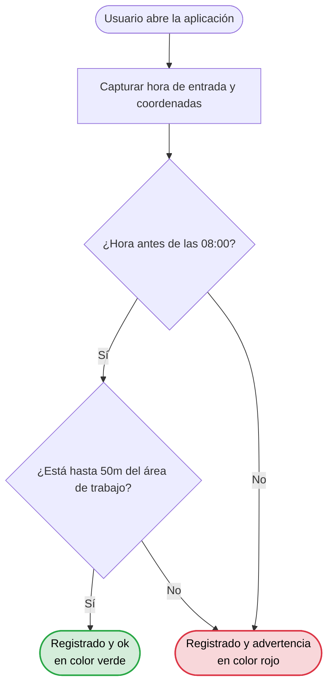

```mermaid
flowchart TD
    A([Usuario abre la aplicación]) --> B[Capturar hora de entrada y coordenadas]
    
    B --> C{"¿Hora antes de las 08:00?"}
    
    C -->|Sí| D{"¿Está hasta 50m del área de trabajo?"}
    C -->|No| F(["Registrado y advertencia<br>en color rojo"])
    
    D -->|Sí| E(["Registrado y ok<br>en color verde"])
    D -->|No| F
    
    classDef verde fill:#d4edda,stroke:#28a745,stroke-width:2px,color:#000
    classDef rojo fill:#f8d7da,stroke:#dc3545,stroke-width:2px,color:#000
    
    class E verde
    class F rojo
```
